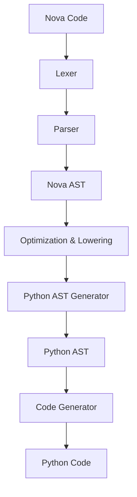

# Nova Transpiler Architecture

The Nova transpiler is the heart of the ecosystem, enabling a modern syntax to run on the rock-solid CPython runtime with 100% interoperability.

## 1. Nova → Python Transpilation Pipeline

This pipeline converts Nova source code into optimized Python code.

1.  **Nova Lexer**: Tokenizes the source code, handling keywords, operators, literals, and curly braces.
2.  **Nova Parser**: Constructs a **Nova Abstract Syntax Tree (Nova AST)** based on the EBNF grammar. It handles operator precedence and block structure.
3.  **AST Transformation**:
    *   **Syntax Lowering**: Modern constructs like the pipeline operator `|>` are lowered into standard function calls.
    *   **Type Erasure/Conversion**: Nova type annotations are converted into Python-compliant type hints (PEP 484).
    *   **Optimization Pass**: Identifies vectorizable loops and replaces them with NumPy/Torch equivalents.
4.  **Python AST Generator**: Maps Nova AST nodes to **Python AST nodes** (using the Python `ast` module).
5.  **Code Generation**: Uses `ast.unparse()` (or a specialized code generator for older Python versions) to produce readable Python source code.

## 2. Python → Nova Transpilation (The "Novifier")

To ensure 100% round-trip fidelity and easy migration, Nova includes a "Novifier" that converts existing Python code into Nova.

1.  **Python AST Parser**: Uses the standard `ast.parse()` to read Python code.
2.  **CST (Concrete Syntax Tree)**: Uses `libcst` to preserve comments, docstrings, and exact formatting.
3.  **Syntax Converter**: Maps Python's indentation-based blocks to Nova's brace-based blocks.
4.  **Keyword Translation**: Converts `def` to `fn`, `except` to `catch`, etc.
5.  **Nova Code Generation**: Produces idiomatic Nova code.

## 3. Error Mapping & Debugging

One of the biggest challenges in transpilation is debugging. Nova solves this via:

*   **Source Maps**: The transpiler generates a mapping between Nova source lines and the generated Python lines.
*   **Traceback Translation**: Nova hooks into the Python `sys.excepthook`. When an exception occurs, the Python traceback is intercepted, and the line numbers/filenames are mapped back to the original Nova source using the source maps.
*   **AI-Enhanced Errors**: If an error occurs in the generated Python code that isn't easily map-able, Nova uses an LLM-based error explainer to suggest the likely cause in the Nova source.

## 4. Edge Case Handling

*   **Dynamic Constructs (`eval`, `exec`)**: Nova transpiles these into Python's `eval` and `exec`, but provides a warning that Nova-specific syntax inside strings might not be parsed at runtime unless the Nova runtime hook is active.
*   **Decorators**: Standard Python decorators work unmodified. Nova-specific decorators are handled during the AST transformation phase.
*   **Dunder Methods**: Nova supports `constructor` which maps to `__init__`, and other dunders are mapped to their Nova equivalents (e.g., `operator+` to `__add__`).

## 5. Performance of Transpilation

The Nova transpiler is written in a combination of Nova (bootstrapped) and highly optimized Python. For large projects, it supports:
*   **Incremental Compilation**: Only transpiles modified files.
*   **Caching**: Stores transpiled Python artifacts in a `.nova_cache` directory.
*   **Parallel Transpilation**: Utilizes multiple CPU cores for large codebases.
